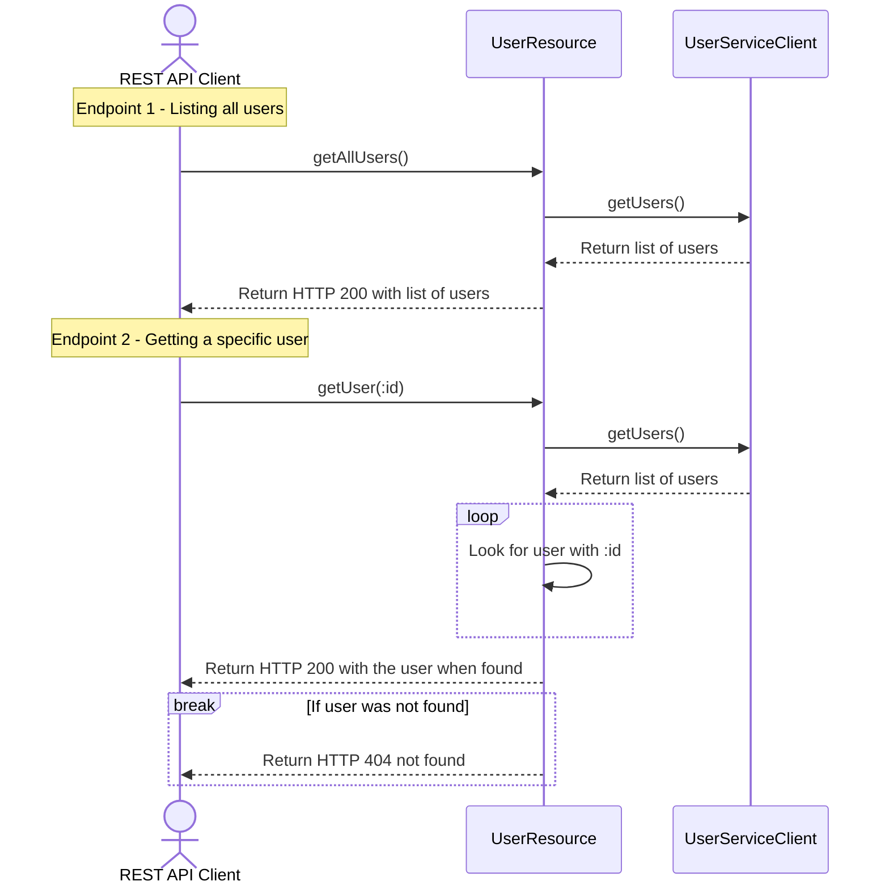

# Recruitment task
Repository for recruitment purposes

## Prerequisites for solving task
You only need Java 21 installed to complete the task. Verify that you can compile and run tests successfully before you continue with the task.

```bash

# build and run all tests
./gradlew clean verify

# start project
`./gradlew bootRun`

# use the swagger-ui in your browser to test the api ...
open http://localhost:8080/swagger-ui/

# ... or just use curl from command line
curl -i http://localhost:8080/users
curl -i http://localhost:8080/users/3
```

## Task description



## Requirements
- Add a caching layer to the REST API with the following requirements :
  - A response containing the requested data must always, under all circumstances, arrive immediately.
  - It is acceptable for the response data to be stale.
  - Maximum staleness time must be configurable.
  - You are not allowed to modify the third-party API URL or the UserServiceClient
  - You are not allowed to use built in caching dependencies, 3rd party caching libraries or caching annotations like `@Cacheable`.

## Example responses from our REST API endpoints
Return all users in an array :
```shell
curl http://localhost:8080/users
```
Result:
```json
[
  {
    "id": 1,
    "name": "Leanne Graham",
    "username": "Bret",
    "email": "Sincere@april.biz",
    "phone": "1-770-736-8031 x56442",
    "website": "hildegard.org"
  },
  {
    "id": 2,
    "name": "Ervin Howell",
    "username": "Antonette",
    "email": "Shanna@melissa.tv",
    "phone": "010-692-6593 x09125",
    "website": "anastasia.net"
  },
  {
    "id": 3,
    "name": "Clementine Bauch",
    "username": "Samantha",
    "email": "Nathan@yesenia.net",
    "phone": "1-463-123-4447",
    "website": "ramiro.info"
  },
  ... and seven more
]
```
---
Returns a user with a specified id :
```shell
curl http://localhost:8080/users/1
```
Result:
```json
{
    "id": 1,
    "name": "Leanne Graham",
    "username": "Bret",
    "email": "Sincere@april.biz",
    "phone": "1-770-736-8031 x56442",
    "website": "hildegard.org"
}
```
---
Response for a user not found :
```shell
curl -i http://localhost:8080/users/999
```
Result:
```shell
HTTP/1.1 404 Not Found
content-length: 0
```